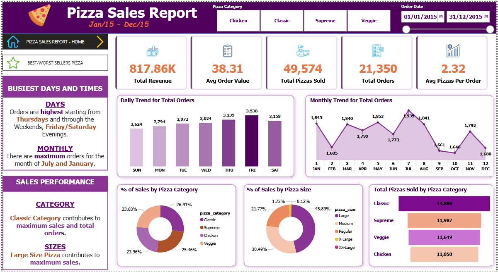
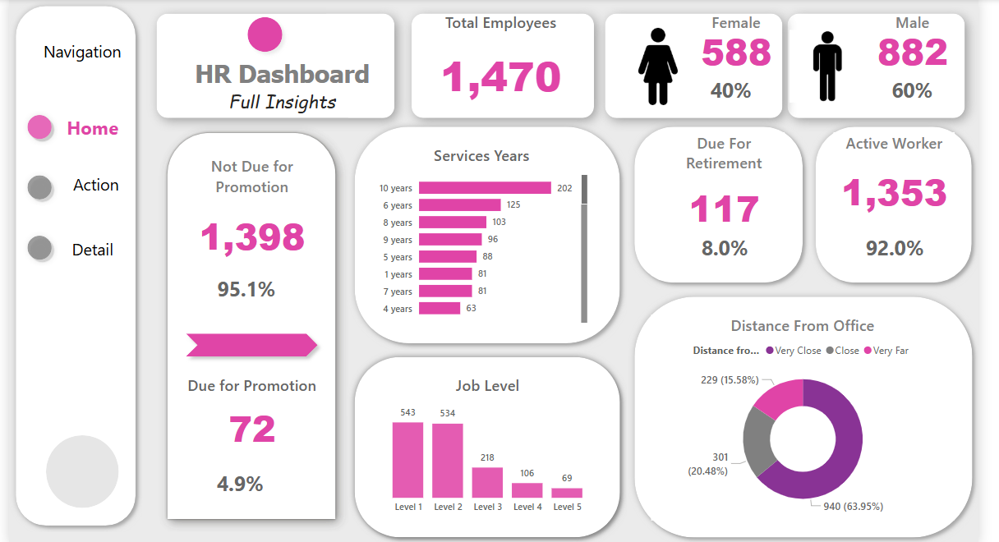
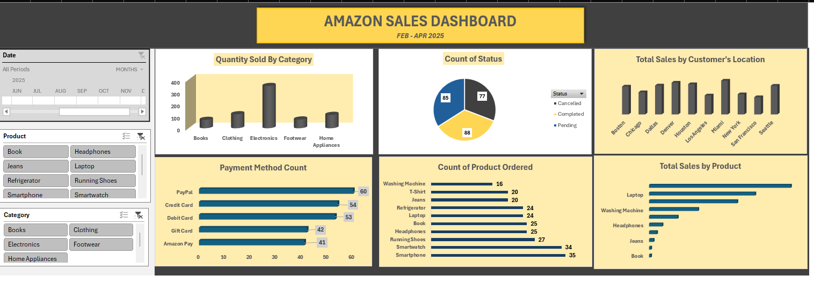

# PROJECTS

## PROJECT I

## [Sales Report Using SQL and PowerBI](https://github.com/Anthonyomowumi/Pizza-Sales-Report)

**Tools Used:** 

PowerBI - Visual Cards, Charts(Column and Bar charts), Doughnut chart, Funnel and line graph, slicers and Timeline.

SQL Data Manipulation Language

**SQL Code:**
[Pizza Sales SQL Code](https://github.com/Anthonyomowumi/github.io/blob/main/Pizza%20Sales.sql)

**PowerBI Dashboard:** 
[Pizza Sales Dashboard](https://github.com/Anthonyomowumi/github.io/blob/main/Pizza%20Sales%20Dashboard.pbix)

**SQL Skills Used:** 
•	Data Retrieval like SELECT Statement, 
•	Data Filtering WHERE Caluse  
•	Data Aggregation like SUM, COUNT, COUNT(DISTINCT),
•	Data Grouping like Group by statement used with the aggregated functions to summarize data
•	Data Source Specification like FROM: Specified the tables used as data sources for retrieval
•	SQL in CAST for data type conversion
•	DATENAME in SQL for extracting a date part as a string.
•	Top N in SQL

### Project Description:
This project involved analyzing a dataset of over 48,000 pizza sales to uncover key business insights for a pizza company. Using SQL, I calculated core KPIs 
including total revenue, average order value, total pizzas sold, total orders, and average pizzas per order. Then visualized trends in Power BI, such as 
daily and monthly order volumes, sales distribution by pizza category and size, and performance of individual pizza types—highlighting the top 5 best-sellers
and bottom 5 by revenue, quantity, and orders. 

### Some Key Insights
**•	Optimize Inventory Management:** Focus on high-demand pizzas and reduce stock of underperforming items to minimize waste.

**•	Improve Sales Strategy:** Use order volume trends to plan marketing and staffing during peak and off-peak periods.

**•	Refine Product Offerings:** Analyze category and size performance to prioritize best-selling combinations.

**•	Maximize Revenue and Profitability:** Leverage KPIs like average order value to implement upselling or combo strategies that increase sales.

Technology used: SQL server (T-SQL) For Database Management and PowerBI For Dashboard.

### PowerBI Dashboard Overview:

## PROJECT II

## [Employee Insights Dashboard: Unlocking Workforce Trends with Power BI](https://github.com/Anthonyomowumi/github.io/blob/main/HR%20ANALYTICS%20DASHBOARD.pbix)

**Tools Used:** 

PowerBI - DAX functions like SUM, SUMX, COUNTX, FILTER, CARDS, CHARTS

## Project Description
This project entailed developing an interactive HR dashboard in Power BI to reveal essential workforce insights. It examined employee distribution across gender, years of service,
job levels, eligibility for promotions, and distance from the office. With the help of DAX functions, fundamental HR KPIs—like total headcount, active employees, retrenchment risk, 
and promotion readiness—were calculated to assess organizational health. The insights facilitated data-informed decision-making in workforce planning, talent retention, succession planning,
and diversity initiatives. The dashboard enables stakeholders to track trends and make educated HR decisions that align with organizational objectives.

### PowerBI Dashboard Overview:

## Project III

## 🔍 Data Exploration and Analysis in SQL Using Different Dataset
**In this project, I applied SQL to perform in-depth data exploration and analysis across multiple datasets, including Employees, Football Players, Workplace Safety, and Customer/Sales/Orders.
My aim was to uncover actionable insights, identify trends, and support data-driven decision-making through structured queries and reporting.**

**Tools Used:** SQL Server, SSMS (SQL Server Management Studio)

**Skills Applied:** Data wrangling, Data Aggregation, filtering, grouping, subqueries, common table expressions (CTEs), joins, and percentage calculations.

**SQL Code:**
[Employees Data SQL DML Code](https://github.com/Anthonyomowumi/github.io/blob/main/Employees%20SQL%20Queries.sql)

**SQL Code:**
[Football Players Data SQL DML Code](https://github.com/Anthonyomowumi/github.io/blob/main/Fottball%20Data%20SQL%20Queries.sql)

**SQL Code:**
[Workplace Safety Data SQL DML Code](https://github.com/Anthonyomowumi/github.io/blob/main/WorkSafety%20Data%20SQL%20Queries.sql)

**SQL Code:**
[Customer_Sales_Orders Data SQL DML Code](https://github.com/Anthonyomowumi/github.io/blob/main/Joins%20and%20Subquery%20On%20Customer_Sales_Orders%20Dataset%20.sql)

## Project IV

## [Chocolate Sales Dashboard](https://github.com/Anthonyomowumi/github.io/blob/main/Chocolate%20Sales%20Dashboard.xlsx)

**Tools Used:**  
Excel, Pivot Table, Pivot Charts, Data Cleaning techniques like Removing Duplicates, Find & Replace, Slicer and Timeline.

### Project Description:
This project focused on analyzing product and sales data for a chocolate company to uncover trends and performance patterns for the year 2022. 
It was designed to deliver a clear, data-driven overview of key performance indicators, including the effectiveness of sales representatives. 
The interactive dashboard enables stakeholders to seamlessly track and evaluate the company’s performance across various regions, product categories, 
and time periods. The dashboard includes the following features:

**•	Total Sales by Country:** Visual representation of sales broken down by each country using a Bar Chart.

**•	Total Sales by Top 10 Product:** A column chart visualizes the total sales of the top 10 best-selling products, clearly comparing product performance.

**•	Sales Trend by Month:** Displays the monthly Sales, allowing for easy comparison of profitability throughout the year.

**•	Top 10 Sales by Salesperson:** A column chart displaying the total sales achieved by the top 10 sales representatives. 

**•	Monthly Shipment of Chocolate Boxes:** A detailed analysis of chocolate box shipments by month, offering insights into trends over time through a line graph.

**•	Count of Chocolate Boxes Shipped to Country:** A pie chart showcasing the distribution of chocolate box shipments across partnering countries.

Additionally, the dashboard also features interactive slicers and a timeline for the following:

**•	Month:** Filter data to analyze performance for a specific month or a selected range of months.

**•	Salesperson:** Isolate data to evaluate the performance of individual sales representatives.

**•	Product:** Dive deeper into the performance of specific chocolate products.

### Key Findings:
**Regional Profitability:** Identified the most profitable regions for chocolate box shipments and highlighted areas where performance can be improved.

**Top-Performing Products:** Highlighted the chocolate products that are generating the most revenue and profit, assisting in inventory and marketing decisions.

**Sales Team Performance:** Evaluated individual salespersons' contributions, revealing top performers and opportunities for targeted coaching or support.

**Seasonal Trends:** Discovered sales and profit patterns aligned with seasonal events, enabling more strategic timing for campaigns and stock planning.

**Sales Volatility:**  Analyzed monthly shipment fluctuations to better understand market dynamics and refine business strategies.

**Country Partnerships:** Assessed the impact of partnerships across different countries, highlighting strong collaborations and identifying regions with potential for growth through improved alliances.

**This dashboard is a key decision-making tool for the chocolate company’s leadership, offering clear, data-driven insights to support growth, improve operations, and strengthen market positioning.**

### Dashboard Overview:

## PROJECT V

## [Amazon Sales Dashboard](https://github.com/Anthonyomowumi/github.io/blob/main/Amazon%20Sales%20Dashboard.xlsx)

**Tools Used:**  
Pivot Table, Pivot Charts, Conditional Formatting, Formulas like SUM, COUNT and IF, Sorting and Filtering, Slicer and Timeline.

### Project Description:
This project involved creating an interactive Amazon sales dashboard using Pivot Tables in Excel to analyze data. The dashboard provided a detailed view of key metrics, 
such as Total Sales by Location, Total Sales by Product, Quantity Sold by Category, Order Status Distribution, Payment Methods, and Customer Insights. 
The dashboard allows stakeholders to monitor and assess sales performance across various regions and product categories, thereby improving customer targeting, 
optimizing payment methods, and enhancing overall sales tracking.The dashboard includes the following features:

**•	Total Sales by Customer’s Location:** Highlights the total sales generated in each customer region, helping to identify key markets and tailor targeted strategies for customer engagement and regional growth.

**•	Total Sales by Product:** Shows the overall sales performance for each product, enabling the identification of top-performing items and areas for potential inventory or marketing optimization.

**•	Quantity Sold by Category:** highlights the total quantity sold across different product categories, providing insights into customer preferences and helping to guide inventory and marketing decisions.

**•	Order Status Distribution:** Displays the distribution of orders based on their status (e.g., Pending, Completed, or Cancelled), offering insights into the order fulfillment process
and helping to identify areas for improvement in processing and customer satisfaction.

**•	Payment Methods:** Analyzes the distribution of orders by payment method, including Amazon Pay, Gift Card, Credit Card, Debit Card, and PayPal. This provides insights into 
customer payment preferences and can provide strategies for optimizing payment options and improving the checkout experience.

The dashboard includes interactive slicers and a timeline:

**•	Month:** Filter data by month or date range for detailed sales trend analysis.

**•	Category:** Assess performance across product categories like Books, Electronics, Clothing, Footwear, and Home Appliances.

**•	Product:** Analyze the performance of individual products within each category for granular insights.

### Some Key Findings:

**•	Electronics Lead in Sales Volume:** Analysis of Quantity Sold by Category showed that Electronics consistently had the highest sales volume, making it the top-performing category during the period.

**•	Top Payment Methods Identified:** Between February and April, PayPal and Credit Card were the most frequently used payment methods, while Gift Card and Amazon Pay were the least 
used—highlighting customer preferences that can inform payment strategy.

**•	Regional Sales Insight – Miami:** Miami recorded the highest total sales, particularly within the Electronics category, indicating strong regional demand for tech products.

**•	Order Status Monitoring Needed:** Although completed orders (88) were the highest, the number of Pending (85) and cancelled (77) orders was also significant. This suggests 
a need for closer monitoring of the fulfillment process. The high cancellation rate may point to potential issues with payment methods or order processing delays that warrant further investigation.

**The dashboard facilitates strategic decision-making in areas including inventory planning, regional marketing, customer engagement, payment optimization, and fulfillment process improvement by providing data-driven insights.**

### Dashboard Overview:

