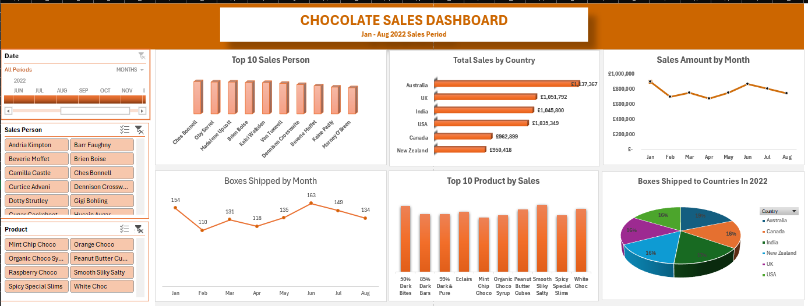

# OMOWUMI ANTHONY PORTFOLIO

### 🎯 [Chocolate Sales Dashboard](https://github.com/Anthonyomowumi/github.io/blob/main/Chocolate%20Sales%20Dashboard.xlsx)

**Tools Used:**  
Excel, Pivot Table, Pivot Charts, Data Cleaning techniques like Removing Duplicates, Find & Replace, Slicer and Timeline.

#### Project Description:
This project focused on analyzing product and sales data for a chocolate company to uncover trends and performance patterns for the year 2022. 
It was designed to deliver a clear, data-driven overview of key performance indicators, including the effectiveness of sales representatives. 
The interactive dashboard enables stakeholders to seamlessly track and evaluate the company’s performance across various regions, product categories, 
and time periods. The dashboard includes the following features:

**•	Total Sales by Country:** Visual representation of sales broken down by each country using a Bar Chart.

**•	Total Sales by Top 10 Product:** A column chart visualizes the total sales of the top 10 best-selling products, clearly comparing product performance.

**•	Sales Trend by Month:** Displays the monthly Sales, allowing for easy comparison of profitability throughout the year.

**•	Top 10 Sales by Salesperson:** A column chart displaying the total sales achieved by the top 10 sales representatives. 

**•	Monthly Shipment of Chocolate Boxes:** A detailed analysis of chocolate box shipments by month, offering insights into trends over time through a line graph.

**•	Count of Chocolate Boxes Shipped to Country:** A pie chart showcasing the distribution of chocolate box shipments across partnering countries.

Additionally, the dashboard also features interactive slicers and a timeline for the following:

**•	Month:** Filter data to analyze performance for a specific month or a selected range of months.

**•	Salesperson:** Isolate data to evaluate the performance of individual sales representatives.

**•	Product:** Dive deeper into the performance of specific chocolate products.

#### Key Findings:
**Regional Profitability:** Identified the most profitable regions for chocolate box shipments and highlighted areas where performance can be improved.

**Top-Performing Products:** Highlighted the chocolate products that are generating the most revenue and profit, assisting in inventory and marketing decisions.

**Sales Team Performance:** Evaluated individual salespersons' contributions, revealing top performers and opportunities for targeted coaching or support.

**Seasonal Trends:** Discovered sales and profit patterns aligned with seasonal events, enabling more strategic timing for campaigns and stock planning.

**Sales Volatility:**  Analyzed monthly shipment fluctuations to better understand market dynamics and refine business strategies.

**Country Partnerships:** Assessed the impact of partnerships across different countries, highlighting strong collaborations and identifying regions with potential for growth through improved alliances.

**This dashboard is a key decision-making tool for the chocolate company’s leadership, offering clear, data-driven insights to support growth, improve operations, and strengthen market positioning.**

#### Dashboard Overview:

---

### 📊 [Amazon Sales Dashboard](https://github.com/Anthonyomowumi/github.io/blob/main/AMAZON.png)
- Built an interactive Amazon sales dashboard using Pivot Tables in Excel.
- Summarized and analyzed key metrics including Total Sales by Location, Quantity Sold by Category, Order Status Counts, Payment Methods, and Customer Details.
- Provided meaningful insights to improve customer targeting, payment optimization, and sales performance tracking.

  
---

### 📈 [Pizza Sales Report Using SQL and PowerBI](https://github.com/Anthonyomowumi/github.io/blob/main/Pizza%20Sales.sql)
- Extracted and analyzed data from SQL databases.
- Built an interactive sales dashboard using Power BI.
- Delivered actionable business insights to improve decision-making.

---

### 📈 [HR Analytics Dashboard Using PowerBI]()
- Designed an interactive HR dashboard in Power BI to visualize workforce insights.
- Analyzed employee distribution by gender, service years, job levels, promotion eligibility, and proximity to the office.
- Integrated SQL data sources to track KPIs like total headcount, active staff, retrenchment risk, and promotion readiness.
- Delivered strategic insights to support HR planning, talent retention, and diversity management.

---

### 🔍 [Data Exploration in SQL]()
- Queried and explored raw datasets using SQL to uncover trends, clean inconsistencies, and prepare data for analysis and visualization.

---

